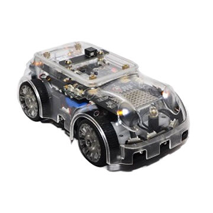

# Altino_Automated_driving_car

### In this procject, we implemented autonomous driving car with "Altino" model car.

Altino is programmable car.

There are many Sensors and Features.

Here is detail of ALTINO : <http://www.saeon.co.kr/main/sub_page.php?page_idx=92>

 

## Projects

#### Project1   - static T course driving

Here is T course

 

1. Turn on your own music when you meet the tunnel, turn off the music when the tunnel is over and go straight

2. T-shape driving: Go straight and when you meet the three-way intersection, turn left and go straight When it meets a wall, it moves backward. When it meets a wall, it moves forward, turns left and goes straight

3. When you meet the tunnel, print your own alphabet on the dot matrix and go straight.

4. End when you return to the place where you left off

#### Project2 - Autonomous driving car

Here is course
 

## Problems

***I have summarized the problems I felt while working on the project.***

1. As I use Bluetooth communication, the response speed of the sensor is slow.

2. Calculate the delay and program it.

3. You have to code differently depending on the course.
